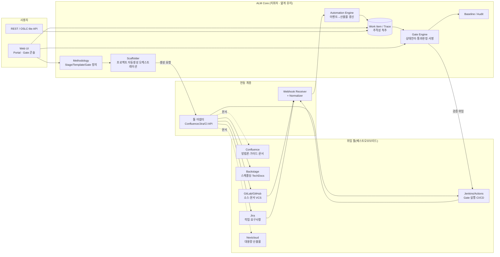

# 00. 설계 개요 (Overview)

## 0. 플랫폼 포지셔닝 — 방법론 실행 플랫폼(MEP)

본 서비스는 문서 저장소가 아니라 **방법론 실행 플랫폼(Methodology Execution Platform)** 이다.
방법론을 *제공*하는 데 그치지 않고, 개발 프로세스에 **강제 적용**하며 산출물 생성·검증을
자동화한다.

**오케스트레이션 우선(Orchestration-first)**: 모든 것을 자체 구현하지 않는다. 검증된 툴
(Confluence·Backstage·Jira·GitLab/GitHub·Jenkins·Nextcloud)을 어댑터로 엮고, ALM Core 는
그 위에서 아래 4가지만 소유(own)한다.

1. **방법론 정의** — Methodology / Stage / ArtifactTemplate / Gate 정의(설정으로 관리)
2. **프로젝트 자동생성 오케스트레이션** — Backstage/Cookiecutter 를 호출해 표준 구조·문서·Jira·Git·CI 생성 ([08](08-project-scaffolding.md))
3. **추적성 척추(spine)** — WorkItem/TraceLink 로 요구사항↔설계↔개발↔테스트↔릴리즈 연결
4. **Gate 상태·승인** — 상태전이 + 통과조건 판정 + 전자서명 ([03](03-gate-workflow.md), [09](09-gate-validation.md))

무거운 실행(문서 편집·저장, 이슈 관리, CI 실행)은 위임하고, Core 는 "지휘자"로 얇게 유지한다.
툴 매핑 상세는 [07-platform-reference-architecture](07-platform-reference-architecture.md).

## 1. 설계 목표

본 서비스는 세 가지 사용자 요구를 만족한다.

| # | 요구 | 설계적 해석 |
|---|---|---|
| ① | 산출물이 **자연스럽게(자동) 생성** | 개발 활동(커밋·PR·이슈·빌드) 이벤트를 방법론이 정의한 산출물 템플릿에 매핑해 데이터를 자동 채움 |
| ② | 산출물이 **중앙에서 통합관리** | 모든 산출물을 단일 "작업항목" 모델로 저장하고 추적성 링크로 연결, 버전·베이스라인으로 관리 |
| ③ | 단계별 **Gate 승인** | 단계 전환을 상태전이로 모델링하고, 전이 시 지정 승인자의 전자서명을 강제 |

## 2. 핵심 설계 원칙

1. **단일 통합 객체 (Work Item)** — 요구사항·태스크·설계·산출물·테스트·결함·변경요청을 모두
   하나의 `WorkItem` 타입 계층으로 표현한다. 유형별로 필드는 다르지만, 링크·버전·상태·권한
   메커니즘은 공통이다. (IBM ELM / Codebeamer 패턴)

2. **문서는 위임, 메타·추적성은 소유** — 문서 본문의 저장·편집은 Confluence 또는 Git(Markdown)에
   위임한다. Core 는 각 문서를 WorkItem 참조가 포함된 *구조화 메타*로 관리하고, 추적성·상태·버전
   포인터만 소유한다. (자체 LiveDoc 렌더러는 필수가 아닌 *선택* 구현 — Polarion LiveDocs 는 참고 패턴)

3. **이벤트 소싱 기반 자동생성** — 산출물은 "누가 작성"하는 것이 아니라 "개발 이벤트에서 도출"된다.
   외부 이벤트(웹훅)를 정규화하여 AutomationRule 로 산출물 필드에 반영한다.

4. **상태전이 = Gate** — 방법론의 단계는 워크플로우 상태이고, 단계 사이의 전환은 Gate이다.
   Gate 통과 조건(필수 산출물 존재, 검증 규칙, 승인 서명)을 만족해야 상태전이가 허용된다.

5. **개방형 링크 & API 우선** — OSLC 를 전면 도입하지는 않되, 모든 아티팩트는 안정적 URI 와
   REST 표현을 가지며, 추적성 링크는 표준화된 관계 타입을 사용한다. (경량 OSLC 벤치마킹)

6. **불변 스냅샷** — 감사 대응을 위해 임의 시점의 전체 산출물 상태를 베이스라인으로 동결한다.

## 3. 도메인 개념 지도

```
Methodology (방법론)  — 3레벨 WBS 로 정의 (예: 단계 6 · 액티비티 22 · 태스크 51)
 └─ Stage[] (레벨1: 단계, Gate 관문 단위)
     ├─ Activity[] (레벨2: 액티비티, 역할별 작업 묶음)
     │    └─ Task[] (레벨3: 태스크 = 체크리스트 항목 · 산출물 생성 단위)
     │         └─ ArtifactTemplate (태스크가 산출하는 문서)
     └─ Gate (단계 종료 승인 지점)
         └─ ApprovalPolicy (필요 승인자/역할/서명 규칙)

Project (프로젝트)  — 방법론 선택 + 테일러링 → EffectiveStage/Activity/Task 로 인스턴스화
 ├─ WorkItem[] (요구사항/태스크/설계/산출물/테스트/결함/변경요청)
 │    └─ TraceLink[] (추적성 링크: satisfies/derives/implements/verifies…)
 ├─ Artifact[] (산출물 = WorkItem 집합에 대한 문서형 뷰, 버전관리)
 ├─ GateInstance[] (각 Gate의 실제 승인 진행 레코드)
 │    └─ Approval[] → Signature (전자서명)
 └─ Baseline[] (스냅샷)

Integration
 ├─ IntegrationEvent[] (Git/CI/이슈트래커 웹훅의 정규화 이벤트)
 └─ AutomationRule[] (이벤트 → 산출물 필드 매핑 규칙)
```

## 4. 논리 아키텍처

오케스트레이션 우선 관점을 반영한 배치. Core 는 얇은 지휘자이고, 실행은 외부 툴에 위임한다.



## 5. 3사 패턴의 반영 위치

| 벤치마크 요소 | 반영된 설계 구성요소 |
|---|---|
| ELM EWM: 커밋↔작업항목↔빌드 연결 | Integration 계층 + AutomationRule + TraceLink |
| ELM: 데이터 취합 자동 문서생성 | Artifact(LiveDoc) 렌더러 + Baseline export |
| ELM/Polarion: 전자서명 Gate | Gate Engine + Approval/Signature |
| Polarion LiveDocs | Artifact = 구조화 WorkItem에 대한 문서형 뷰 |
| Polarion Git 네이티브 | Integration(Git) + 변경↔WorkItem 추적성 |
| Codebeamer 컴플라이언스 템플릿 | Methodology / ArtifactTemplate 사전구성 |
| Codebeamer 유연 워크플로우 | Stage/Gate 를 설정(config)으로 정의 |
| OSLC 개방형 링크 | REST/OSLC-lite API + 표준 링크 타입 |
