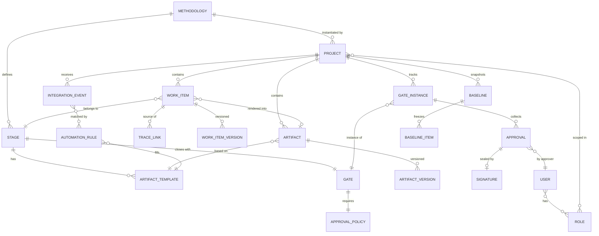
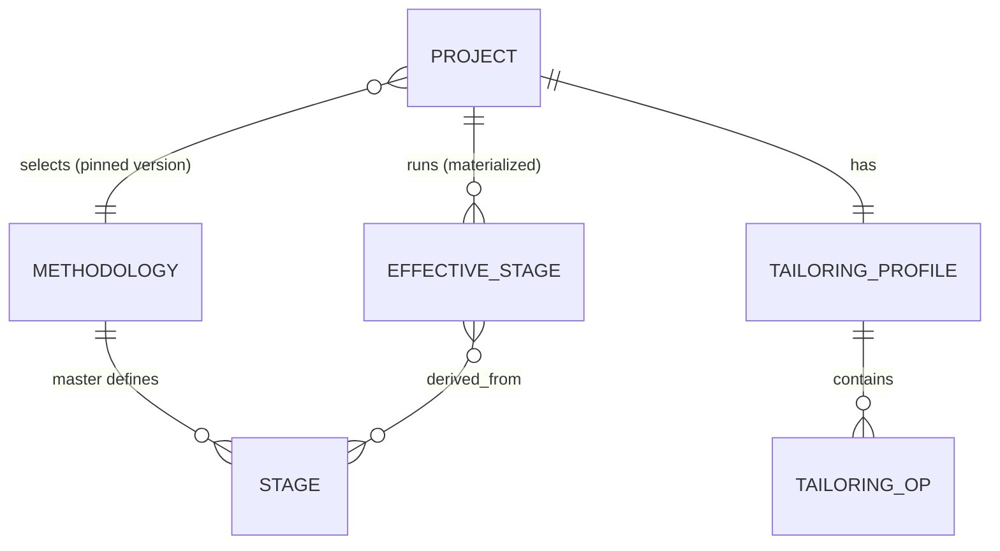

# 01. 데이터 모델 (Data Model)

방법론 단계 `요구사항定義 → 설계 → 구현 → 테스트 → 배포` 를 지지하는 핵심 스키마.

## 1. ERD



## 2. 방법론 정의 계층 (Definition — 설정으로 관리)

### METHODOLOGY
방법론 자체. 여러 프로젝트가 참조하며, 버전관리된다 (Polarion "글로벌 설정 버전관리" 패턴).

| 필드 | 타입 | 설명 |
|---|---|---|
| id | uuid | |
| name | text | 예: "의료기기 SW (IEC 62304)" |
| version | semver | 방법론 개정 이력 |
| compliance_tags | text[] | `IEC62304`, `ISO26262`, `DO-178C`, `21CFR11` … |
| status | enum | `draft` / `published` / `deprecated` |

### STAGE
방법론의 단계. 순서(order)로 파이프라인을 형성한다.

| 필드 | 타입 | 설명 |
|---|---|---|
| id | uuid | |
| methodology_id | fk | |
| key | text | `requirements` / `design` / `implementation` / `test` / `deployment` |
| name | text | 표시명 |
| order | int | 단계 순서 |
| entry_criteria | jsonb | 진입 조건(선행 Gate 통과 등) |

### ARTIFACT_TEMPLATE
단계에서 산출되어야 할 문서의 틀. 필드 스키마 + 자동생성 매핑을 포함.

| 필드 | 타입 | 설명 |
|---|---|---|
| id | uuid | |
| stage_id | fk | |
| key | text | `SRS`, `SDD`, `TestPlan`, `TraceMatrix`, `ReleaseNote` … |
| schema | jsonb | 문단/항목 구조 정의 (LiveDoc 블록 스키마) |
| autofill_source | jsonb | 자동 채움 소스(어떤 WorkItem 쿼리/이벤트로 채우는지) |
| required_for_gate | bool | 이 산출물이 없으면 Gate 통과 불가 |

### GATE / APPROVAL_POLICY
단계 종료 승인 지점과 그 승인 규칙. 상세 상태전이는 [03-gate-workflow](03-gate-workflow.md).

| GATE 필드 | 설명 |
|---|---|
| id, stage_id | 어느 단계를 닫는 Gate 인지 |
| key | `G1`..`G5` |
| pass_conditions | jsonb — 필수 산출물 존재, 미해결 결함 0, 추적성 커버리지 ≥ N% 등 |

| APPROVAL_POLICY 필드 | 설명 |
|---|---|
| gate_id | |
| required_roles | text[] — 예: `["QA_Lead","Project_Manager"]` |
| quorum | int — 최소 승인자 수 |
| signature_required | bool — 전자서명 강제 여부 |
| order | enum — `parallel`(동시) / `sequential`(순차) |

## 3. 실행 데이터 계층 (Runtime)

### WORK_ITEM  ← 통합 객체(핵심)
모든 산출 요소의 상위 타입. `type` 으로 구분하고 `attributes` 에 타입별 필드를 담는다.

| 필드 | 타입 | 설명 |
|---|---|---|
| id | uuid | |
| project_id | fk | |
| stage_id | fk | 소속 단계 |
| type | enum | `requirement` / `task` / `design` / `test_case` / `defect` / `change_request` / `artifact_section` |
| key | text | 사람이 읽는 식별자 `REQ-101`, `TC-24` |
| title | text | |
| attributes | jsonb | 타입별 필드 (예: requirement 의 priority·verification_method) |
| state | text | 워크플로우 상태 (`draft`/`in_review`/`approved`/`implemented`/`verified`/`closed`) |
| origin | enum | `manual` / `auto` — 자동생성 여부 |
| source_ref | jsonb | 자동생성 시 원천(커밋 SHA, PR 번호, 이슈 키) |
| created_at, updated_at | ts | |

> **타입별 예시 attributes**
> - `requirement`: `{priority, verification_method, safety_class}`
> - `task`: `{assignee, estimate, sprint}`
> - `test_case`: `{steps[], expected, last_result}`
> - `defect`: `{severity, found_in_build, status}`

### TRACE_LINK  ← 추적성
작업항목 간 방향성 있는 관계. 추적성 매트릭스와 Gate 커버리지 판정의 근거.

| 필드 | 타입 | 설명 |
|---|---|---|
| id | uuid | |
| source_id | fk(work_item) | |
| target_id | fk(work_item) | |
| type | enum | `derives`(파생) / `satisfies`(충족) / `implements`(구현) / `verifies`(검증) / `traces_to` / `impacts` |
| created_by | enum | `manual` / `auto` |

표준 링크 방향(권장):

```
requirement --satisfies--> stakeholder_need
design      --derives---->  requirement
task/commit --implements--> design | requirement
test_case   --verifies---> requirement
defect      --impacts----> requirement | test_case
```

### WORK_ITEM_VERSION / ARTIFACT_VERSION
모든 변경은 append-only 버전 레코드를 남긴다 (Polarion "모든 변경 자동 이력"). 필드 diff + 작성자 + 사유(연결된 change_request) 저장.

### ARTIFACT  ← 산출물(LiveDoc)
`ARTIFACT_TEMPLATE` 기반으로 만들어진 실제 문서. **원천이 아니라 WorkItem 집합의 문서형 뷰**.

| 필드 | 타입 | 설명 |
|---|---|---|
| id | uuid | |
| project_id, template_id | fk | |
| title | text | |
| blocks | jsonb | 문단/섹션 배열. 각 block 은 `work_item_id` 참조 또는 정적 텍스트 |
| render_state | enum | `auto_generated` / `edited` / `finalized` |
| doc_version | int | Gate 승인 시점에 동결되는 버전 |

> block 예시:
> ```json
> {"type":"section","title":"3.2 기능 요구사항",
>  "children":[{"type":"ref","work_item_id":"REQ-101"},
>              {"type":"ref","work_item_id":"REQ-102"}]}
> ```

### GATE_INSTANCE / APPROVAL / SIGNATURE
[03-gate-workflow](03-gate-workflow.md) 에서 상세히 다룬다. 요약:

- **GATE_INSTANCE**: 특정 프로젝트에서 특정 Gate 의 승인 진행 상태 (`open`/`in_approval`/`passed`/`rejected`).
- **APPROVAL**: 승인자 1인의 결정 (`pending`/`approved`/`rejected` + comment).
- **SIGNATURE**: 전자서명 봉인 — `signer_id`, `signed_at`, `payload_hash`(승인 대상 산출물 스냅샷 해시), `method`(password re-auth / cert / OTP). 위·변조 방지를 위해 해시 체인.

### INTEGRATION_EVENT / AUTOMATION_RULE
[02-artifact-automation](02-artifact-automation.md) 에서 상세. 정규화된 외부 이벤트와 그 처리 규칙.

### BASELINE / BASELINE_ITEM
[06-baseline-audit](06-baseline-audit.md) 참조. 특정 시점 전체 상태의 불변 동결.

## 7. 테일러링 계층 (Tailoring)

방법론 등록·선택·**테일러링(병합/생략)**·프로젝트별 진행을 지지하는 스키마.
개념·연산·거버넌스는 [10-tailoring](10-tailoring.md) 참조.



### TAILORING_PROFILE
프로젝트 1개에 대한 테일러링 묶음. 승인되어야 적용된다(거버넌스).

| 필드 | 타입 | 설명 |
|---|---|---|
| id | uuid | |
| project_id | fk | 1:1 |
| methodology_id / methodology_version | fk / semver | 선택·고정된 방법론 |
| status | enum | `draft` / `in_review` / `approved` / `active` |
| approved_by, approved_at | | 테일러링 승인 기록(감사) |
| rationale | text | 전체 테일러링 사유 |

### TAILORING_OP
개별 테일러링 연산. 근거(rationale) 필수.

| 필드 | 타입 | 설명 |
|---|---|---|
| id | uuid | |
| profile_id | fk | |
| type | enum | `merge` / `omit` / `modify_artifact` / `add` |
| source_stage_keys | text[] | 대상 마스터 단계들 |
| result_stage_key / result_name | text | 병합·추가 결과 단계 |
| artifact_changes | jsonb | `[{artifact, action: require\|optional\|waive, reassign_to}]` |
| rationale | text | **필수** — 왜 병합/생략하는가 |

> 정책 보호: 마스터 STAGE/ARTIFACT_TEMPLATE 의 `mandatory:true` 항목은 `omit`/`waive` 불가.

### EFFECTIVE_STAGE
테일러링 합성 결과 = **프로젝트가 실제로 밟는 단계**. 파이프라인·Gate·진행의 기준.

| 필드 | 타입 | 설명 |
|---|---|---|
| id | uuid | |
| project_id | fk | |
| key / name | text | 예: `analysis_design` / `분석·설계` |
| order | int | 재계산된 순서 |
| derived_from | text[] | 유래한 마스터 단계 키(병합이면 다수) |
| gate_key | text | 통합 Gate 키(예: `G12`) |
| state | enum | `locked` / `active` / `in_gate_review` / `passed` ← **단계별 진행 관리** |

> WorkItem/Artifact 는 `stage_id` 대신(또는 함께) `effective_stage_id` 로 바인딩되어,
> 테일러링된 파이프라인 위에서 추적성·Gate 커버리지가 계산된다.

## 4. 상태값 요약

| 대상 | 상태 |
|---|---|
| WorkItem | `draft → in_review → approved → implemented → verified → closed` |
| Artifact | `auto_generated → edited → finalized(=doc_version 동결)` |
| GateInstance | `open → in_approval → passed \| rejected` |
| Stage / EffectiveStage | `locked → active → in_gate_review → passed` |
| TailoringProfile | `draft → in_review → approved → active` |

각 상태전이 규칙과 강제 조건은 다음 문서들에서 구체화한다.
