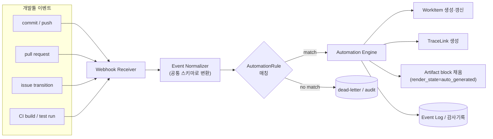

# 02. 산출물 자동생성 파이프라인 (Artifact Automation)

요구 ①: "산출물이 자연스럽게(자동) 생성된다."
→ 개발 이벤트를 트리거로 방법론 산출물 템플릿에 데이터를 자동으로 채운다.

## 1. 처리 파이프라인



## 2. 정규화 이벤트 스키마

모든 외부 웹훅은 아래 공통 형태로 변환되어 규칙 매칭에 사용된다.

```json
{
  "source": "github",          // github | gitlab | jira | jenkins | actions
  "kind": "commit",            // commit | pull_request | issue | build | test_result
  "action": "pushed",          // opened | merged | transitioned | succeeded | failed
  "refs": {
    "commit_sha": "a1b2c3",
    "pr_number": 42,
    "issue_key": "PROJ-17",
    "build_id": "ci-1099",
    "branch": "feature/req-101"
  },
  "actor": "dev@corp.com",
  "payload": { "message": "REQ-101 구현 완료 (#42)", "files": ["src/x.ts"] },
  "occurred_at": "2026-07-07T05:40:00Z"
}
```

## 3. AutomationRule (이벤트 → 산출물 매핑)

규칙은 **조건(when)** 과 **행위(then)** 로 구성된다. 방법론/프로젝트 설정으로 관리.

```yaml
# 예: 커밋 메시지의 REQ-키를 파싱해 요구사항↔구현 추적성 자동 연결
- id: link-commit-to-requirement
  when:
    kind: commit
    message_matches: 'REQ-(\d+)'
  then:
    - upsert_work_item:
        type: task
        key: "TASK-from-{commit_sha}"
        source_ref: { commit_sha: "{commit_sha}" }
        origin: auto
    - create_trace_link:
        source: "TASK-from-{commit_sha}"
        target: "REQ-{match.1}"
        type: implements

# 예: CI 테스트 결과를 테스트 산출물에 자동 반영
- id: fill-test-report
  when:
    kind: test_result
  then:
    - update_work_item:
        match: { type: test_case, key: "{payload.test_id}" }
        set: { "attributes.last_result": "{payload.status}" }
    - refresh_artifact:
        template: TestReport
        render_state: auto_generated

# 예: PR 머지 시 구현 요구사항 상태 전이 후보로 표시
- id: pr-merge-advance
  when: { kind: pull_request, action: merged }
  then:
    - suggest_state:
        target_links: "implements"
        to_state: implemented
```

### 매핑 원칙
- **커밋/PR ↔ 작업항목**: 커밋 메시지·브랜치·PR 본문에서 `REQ-`, `TASK-`, 이슈키를 파싱해
  `implements` / `traces_to` 링크 생성 (ELM EWM 커밋↔작업항목 연결, Polarion 커밋 추적성).
- **CI 빌드·테스트 ↔ 테스트 산출물**: 빌드/테스트 결과를 `test_case.last_result`,
  `defect` 로 반영하고 TestReport 산출물을 재렌더.
- **이슈 상태전이 ↔ WorkItem 상태**: Jira 전이를 대응 WorkItem 상태 전이의 *제안*으로 반영
  (자동 확정이 아니라 리뷰 후 확정 — 규제 대응).

## 4. 자동생성 vs 수동편집의 공존

Polarion LiveDocs 처럼 "자동 채움 + 사람 편집"이 충돌하지 않도록:

- Artifact block 은 `source: auto | manual` 를 가진다.
- 자동 채움은 `auto` block 만 갱신하며, 사람이 편집(→ `manual`, `render_state=edited`)한 block 은
  덮어쓰지 않는다.
- 자동 소스와 수동 편집이 diverge 하면 UI 에 **동기화 배지**(source drift)를 표시하고
  머지 여부를 사용자에게 위임.

## 5. 멱등성·신뢰성

- 각 이벤트는 `(source, kind, dedup_key)` 로 멱등 처리 (웹훅 중복 수신 대비).
- 매칭 실패 이벤트는 dead-letter 로 보관 후 규칙 추가 시 재처리 가능.
- 모든 자동 변경은 `origin=auto` + `source_ref` 로 표시되어 감사 시 "왜/무엇으로 생성됐는지" 추적.

## 6. Gate 와의 접점
자동생성된 산출물이라도 Gate 통과에는 사람의 승인이 필요하다. 자동화는 *산출물을 준비*하고,
Gate 는 *산출물을 확정*한다. 상세는 [03-gate-workflow](03-gate-workflow.md).
