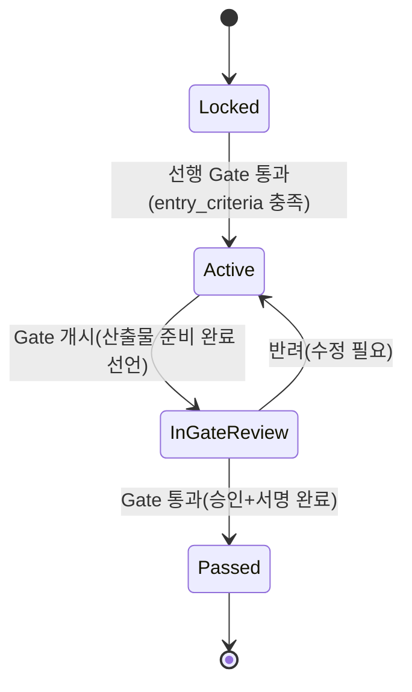
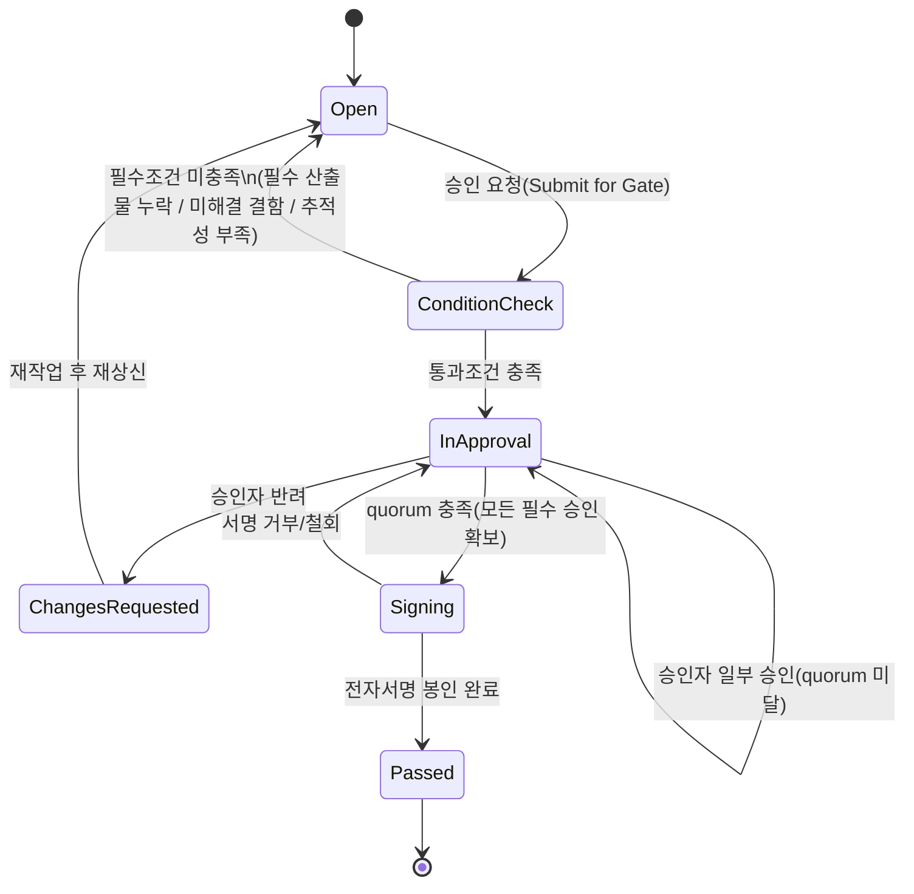
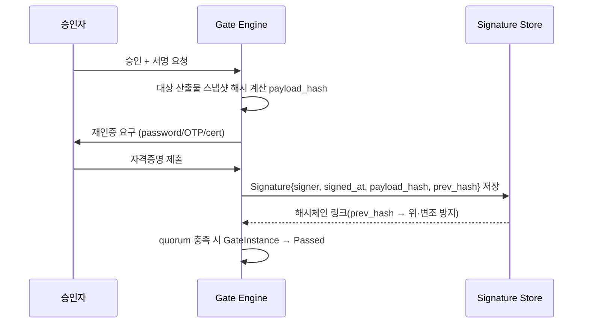
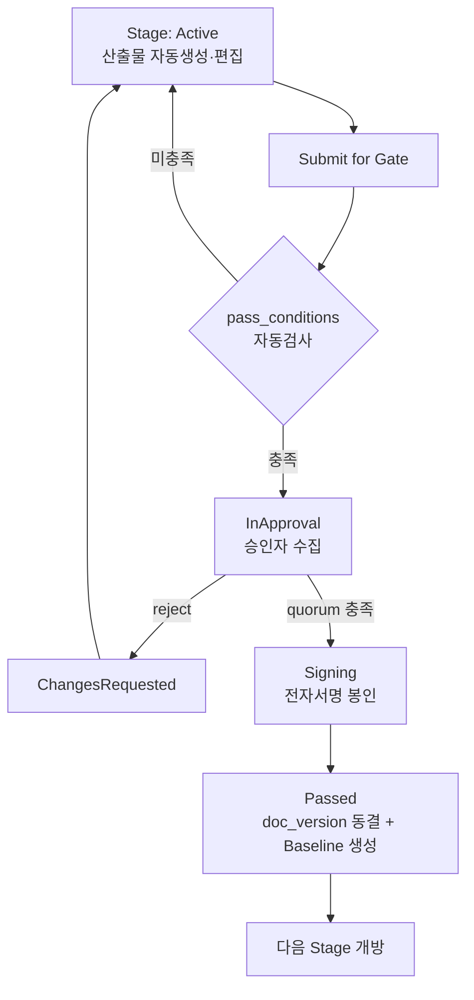

# 03. Gate 승인 워크플로우 (State Transition + 전자서명)

요구 ③: 단계별 Gate 승인.
→ 방법론 단계를 워크플로우 상태로 정의하고, 단계 전환 시 지정 승인자의 전자서명을 강제한다.

## 1. 단계 파이프라인과 Gate 위치

```
[요구사항] --G1--> [설계] --G2--> [구현] --G3--> [테스트] --G4--> [배포] --G5--> (릴리스)
```

각 Gate 는 "선행 단계의 산출물을 확정하고 다음 단계 진입을 허가"한다.

## 2. Stage 상태전이

한 단계(Stage)의 생애주기.



- `Locked`: 선행 Gate 미통과. 편집 불가(읽기전용).
- `Active`: 작업 진행. 산출물 자동생성·편집 가능.
- `InGateReview`: Gate 승인 진행 중. 산출물 **동결 후보** — 편집 잠금(변경하려면 반려).
- `Passed`: 다음 단계 `Locked→Active` 전환을 트리거.

## 3. GateInstance 상태전이 (핵심)

Gate 승인 자체의 상태 머신. 통과 조건 검사 → 승인 수집 → 서명 봉인.



### 상태별 규칙

| 상태 | 진입 조건 | 이 상태에서 허용되는 행위 |
|---|---|---|
| `Open` | 초기/재상신 | 산출물 편집, 제출(Submit) |
| `ConditionCheck` | 제출 | 자동 검사만 (사람 개입 X) |
| `InApproval` | 조건 충족 | 승인자 approve/reject, 코멘트 |
| `ChangesRequested` | 반려 발생 | 작성자 수정 → Open 재진입 |
| `Signing` | quorum 충족 | 전자서명 수행 |
| `Passed` | 서명 완료 | 산출물 doc_version 동결, 베이스라인 생성, 다음 Stage 개방 |

## 4. 통과 조건(pass_conditions) 예시

`ConditionCheck` 단계에서 자동 평가되는 규칙 (Gate 별로 방법론이 정의):

```yaml
G1_requirements_gate:
  required_artifacts: [SRS, StakeholderNeeds]     # 필수 산출물 존재
  trace_coverage:                                  # 추적성 커버리지
    - { from: requirement, link: satisfies, min: 100% }
  open_defects_max: 0
  all_work_items_state_in: [approved]

G4_test_gate:
  required_artifacts: [TestPlan, TestReport, TraceMatrix]
  trace_coverage:
    - { from: requirement, link: verifies, min: 95% }   # 요구사항의 95%가 테스트로 검증
  test_pass_rate_min: 100%
  open_defects_severity_max: minor
```

조건 미충족 시 `Open` 으로 되돌리며, UI 에 **미충족 항목 체크리스트**를 표시한다.

## 5. 승인 정책 (APPROVAL_POLICY)

```yaml
G4_test_gate:
  required_roles: [QA_Lead, Project_Manager]
  quorum: 2
  order: sequential        # QA_Lead 승인 후 PM 승인
  signature_required: true
  reauth: password         # 서명 시 재인증 방식
```

- `parallel`: 필수 역할이 동시에 승인 가능, quorum 충족 시 진행.
- `sequential`: 지정 순서대로 승인(예: 실무 검토 → 관리 승인).
- 어떤 승인자도 `reject` 하면 즉시 `ChangesRequested`.

## 6. 전자서명 (Signature)

Polarion/ELM 전자서명 패턴. 서명은 "그 시점의 산출물 스냅샷"에 대한 봉인이다.



Signature 레코드 필드:

| 필드 | 설명 |
|---|---|
| approval_id | 어떤 승인에 대한 서명인지 |
| signer_id | 서명자 |
| signed_at | 서명 시각(UTC) |
| method | `password` / `otp` / `x509_cert` |
| payload_hash | 승인 대상(산출물+메타) 스냅샷의 SHA-256 |
| prev_hash | 직전 서명 해시 — **해시 체인**으로 순서·무결성 보장 |
| meaning | 서명 의미 문구 ("검토함"/"승인함") — 21 CFR Part 11 대응 |

> **무결성**: `payload_hash` 로 서명 후 산출물이 바뀌면 서명이 무효화됨을 탐지.
> Gate 통과 시 해당 스냅샷은 Baseline 으로 불변 동결된다([06](06-baseline-audit.md)).

## 7. 전체 흐름 한눈에



## 8. 권한(RBAC) 접점
- 산출물 편집: 해당 Stage 의 담당자 역할.
- Gate 제출: 작성자/리드.
- Gate 승인·서명: `APPROVAL_POLICY.required_roles` 에 지정된 역할만.
- "올바른 사람이, 올바른 시점에" 만 승인 가능하도록 상태 × 역할 매트릭스로 강제 (ELM 패턴).
