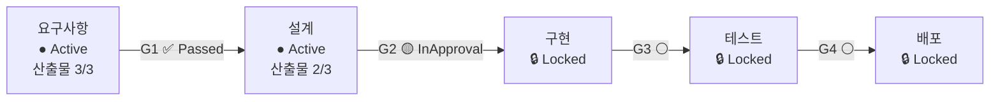
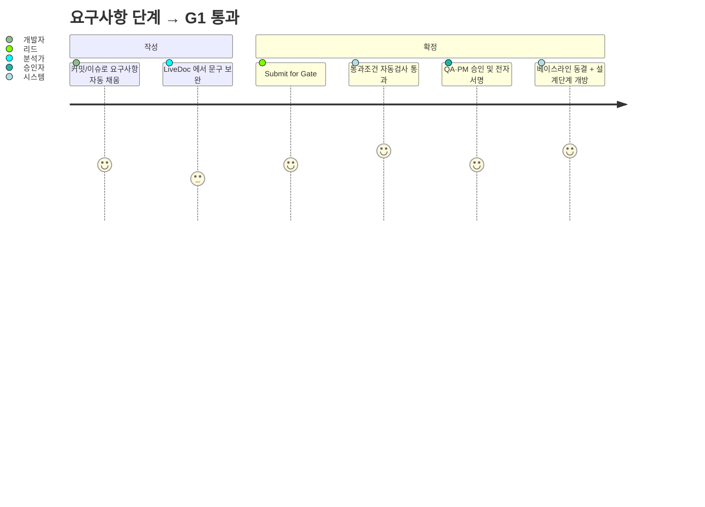

# 04. 화면 흐름 (Screen Flow & IA)

데이터모델([01](01-data-model.md))과 Gate 워크플로우([03](03-gate-workflow.md))를 사용자가
어떻게 경험하는지의 정보구조.

## 1. 내비게이션 구조

```
프로젝트 대시보드
├─ 파이프라인 뷰 (단계 × Gate 진행 상태)
├─ 산출물 (Artifacts / LiveDoc)
│   ├─ 문서 편집기 (문단 = WorkItem 참조)
│   └─ 산출물 버전 이력
├─ 작업항목 (Work Items)
│   ├─ 목록/필터 (type·state·stage)
│   ├─ 상세 (attributes + 추적성 패널)
│   └─ 추적성 매트릭스
├─ Gate 콘솔
│   ├─ 통과조건 체크리스트
│   ├─ 승인 진행(승인자·서명 상태)
│   └─ 전자서명 수행
├─ 연동 (Integrations)
│   ├─ 연결된 저장소/CI/이슈트래커
│   ├─ AutomationRule 편집
│   └─ 이벤트 로그(자동생성 추적)
└─ 베이스라인 / 감사
    ├─ 베이스라인 목록·비교(diff)
    └─ 감사 로그
```

## 2. 핵심 화면 ① — 파이프라인 뷰 (대시보드)

방법론 단계를 가로 레인으로 보여주고 각 Gate 상태를 신호등으로 표시.



- Gate 클릭 → Gate 콘솔.
- 각 단계 카드: 필수 산출물 충족도, 미해결 결함 수, 추적성 커버리지 요약.

## 3. 핵심 화면 ② — 산출물(LiveDoc) 편집기

문서형 UI 지만 각 문단이 WorkItem 참조 (Polarion LiveDocs).

```
┌───────────────────────────────────────────────┐
│ SRS - 소프트웨어 요구사항 명세  [auto_generated]│
├───────────────────────────────────────────────┤
│ 3. 기능 요구사항                                │
│  ┌─ REQ-101  로그인 지원          [auto]  🔗2 │  ← WorkItem 참조 block
│  │  우선순위: High  검증방법: Test            │
│  └─ REQ-102  비밀번호 정책        [edited] 🔗1 │  ← 사람이 편집한 block
│                                                 │
│  ⚠ source drift: REQ-102 원천이 갱신됨 [머지]  │  ← 자동/수동 동기화 배지
├───────────────────────────────────────────────┤
│ [자동 새로고침] [버전 이력] [Submit for Gate]  │
└───────────────────────────────────────────────┘
```

- `[auto]` block 은 이벤트로 자동 갱신, `[edited]` 는 보존.
- 우측 🔗 추적성 링크 수 → 클릭 시 연결 WorkItem 미리보기.
- `InGateReview` 상태에서는 편집 잠금 + "동결 후보" 배너.

## 4. 핵심 화면 ③ — Gate 콘솔

```
┌──────────────── G4: 테스트 Gate ────────────────┐
│ 상태: InApproval                                 │
│                                                  │
│ ✅ 통과조건                                       │
│   ✔ 필수 산출물: TestPlan, TestReport, TraceMx   │
│   ✔ 테스트 통과율 100% (요구: 100%)              │
│   ✔ 검증 추적성 96% (요구: ≥95%)                 │
│   ✘ 미해결 결함: 1 (major) — 허용 minor          │  ← 미충족 항목 강조
│                                                  │
│ 👥 승인 (sequential, quorum 2)                   │
│   1. QA_Lead   ✅ 승인·서명 완료 (07-07 14:20)   │
│   2. PM        🕓 대기                            │
│                                                  │
│ [반려] [승인 및 전자서명]                        │
└──────────────────────────────────────────────────┘
```

- 미충족 조건이 있으면 승인 버튼 비활성(또는 조건부 우회는 별도 권한·사유 기록).
- "승인 및 전자서명" → 재인증 모달 → Signature 봉인.

## 5. 핵심 화면 ④ — 추적성 매트릭스

행=요구사항, 열=설계/구현/테스트. 셀=링크 존재 여부. Gate 커버리지 판정과 직결.

```
            SDD  Commit  TC   결과
REQ-101      ✔    ✔      ✔    Pass
REQ-102      ✔    ✔      ✔    Pass
REQ-103      ✔    —      ✘    (미검증)   ← 커버리지 갭 하이라이트
```

## 6. 핵심 화면 ⑤ — 연동/이벤트 로그

자동생성의 "왜"를 추적 (감사 대응).

```
07-07 05:40  github/commit a1b2c3  "REQ-101 구현"
             → TASK-9001 생성(auto) + TASK-9001 implements REQ-101
07-07 05:41  actions/test_result   suite#88 pass
             → TC-24.last_result=Pass, TestReport 재렌더
```

## 7. 상태에 따른 화면 잠금 규칙

| Stage 상태 | 산출물 편집 | Gate 제출 | 승인/서명 |
|---|---|---|---|
| Locked | ✘(읽기전용) | ✘ | ✘ |
| Active | ✔ | ✔(조건 충족 시) | ✘ |
| InGateReview | ✘(동결후보) | — | ✔(정책 역할) |
| Passed | ✘(불변) | — | — |

## 8. 사용자 여정 요약


