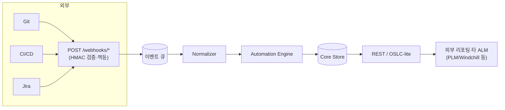

# 05. 연동 & API (Integration / OSLC-lite)

요구 ①·②의 기술 접점. 개발툴과의 연동(웹훅 인바운드)과 개방형 아티팩트 API(아웃바운드).

## 1. 인바운드 웹훅

| 소스 | 이벤트 | 매핑 결과 |
|---|---|---|
| GitHub / GitLab | push, pull_request, review | 커밋↔WorkItem `implements` 링크, PR 상태 반영 |
| Jenkins / GitHub Actions | build, test_result, deploy | TestReport 갱신, defect 생성, ReleaseNote 채움 |
| Jira / 이슈트래커 | issue transition | WorkItem 상태 전이 제안 |

엔드포인트: `POST /webhooks/{source}` — 서명 검증(HMAC) 후 [02](02-artifact-automation.md)의
Event Normalizer 로 전달. 멱등키로 중복 제거.

## 2. 아웃바운드 REST API (자원 모델)

모든 아티팩트는 안정적 URI + JSON 표현을 가진다. (경량 OSLC 지향)

```
GET    /projects/{id}/work-items?type=&state=&stage=
GET    /work-items/{id}
POST   /work-items
PATCH  /work-items/{id}
GET    /work-items/{id}/links                # 추적성
POST   /work-items/{id}/links                # {target, type}

GET    /projects/{id}/artifacts
GET    /artifacts/{id}                        # LiveDoc(blocks)
POST   /artifacts/{id}:render                 # 자동 재생성
GET    /artifacts/{id}/versions

GET    /projects/{id}/gates
GET    /gates/{instanceId}                    # 상태·통과조건·승인현황
POST   /gates/{instanceId}:submit
POST   /gates/{instanceId}/approvals          # {decision, comment}
POST   /gates/{instanceId}/signatures         # 재인증 후 서명 봉인

GET    /projects/{id}/baselines
POST   /projects/{id}/baselines               # 스냅샷 생성
GET    /baselines/{id}/diff?to={otherId}
```

## 3. 표준 아티팩트 스키마 (링크 우선)

OSLC 를 전면 채택하진 않되, "안정 URI + 표준 관계 타입"이라는 핵심만 취한다.

```json
{
  "id": "REQ-101",
  "uri": "https://alm.example.com/work-items/REQ-101",
  "type": "requirement",
  "title": "로그인 지원",
  "attributes": { "priority": "High", "verification_method": "Test" },
  "state": "approved",
  "origin": "auto",
  "source_ref": { "commit_sha": "a1b2c3" },
  "links": [
    { "rel": "satisfies", "href": ".../work-items/NEED-3" },
    { "rel": "verified_by", "href": ".../work-items/TC-24" }
  ]
}
```

표준 링크 관계(`rel`): `derives`, `satisfies`, `implements`, `verifies`/`verified_by`,
`traces_to`, `impacts`. 양방향 조회를 위해 역관계를 함께 노출.

## 4. 연동 아키텍처



## 5. 확장 연동 (향후)
- **양방향 이슈 동기화**: Jira↔WorkItem 필드 매핑(선택적, 충돌 정책 명시).
- **문서 export**: Baseline → PDF/Word/Excel (ELM 자동 문서생성 대응, 감사 제출용).
- **PLM 연동**: Windchill 등 상위 PLM 과 아티팩트 링크 교환(OSLC-lite href).

## 6. 인증·보안 요점
- 웹훅: 소스별 시크릿 기반 HMAC 서명 검증.
- API: OAuth2 / API 토큰, 프로젝트 스코프 RBAC.
- 서명 봉인: 승인 API 는 재인증(step-up) 필수, 감사로그 남김.
