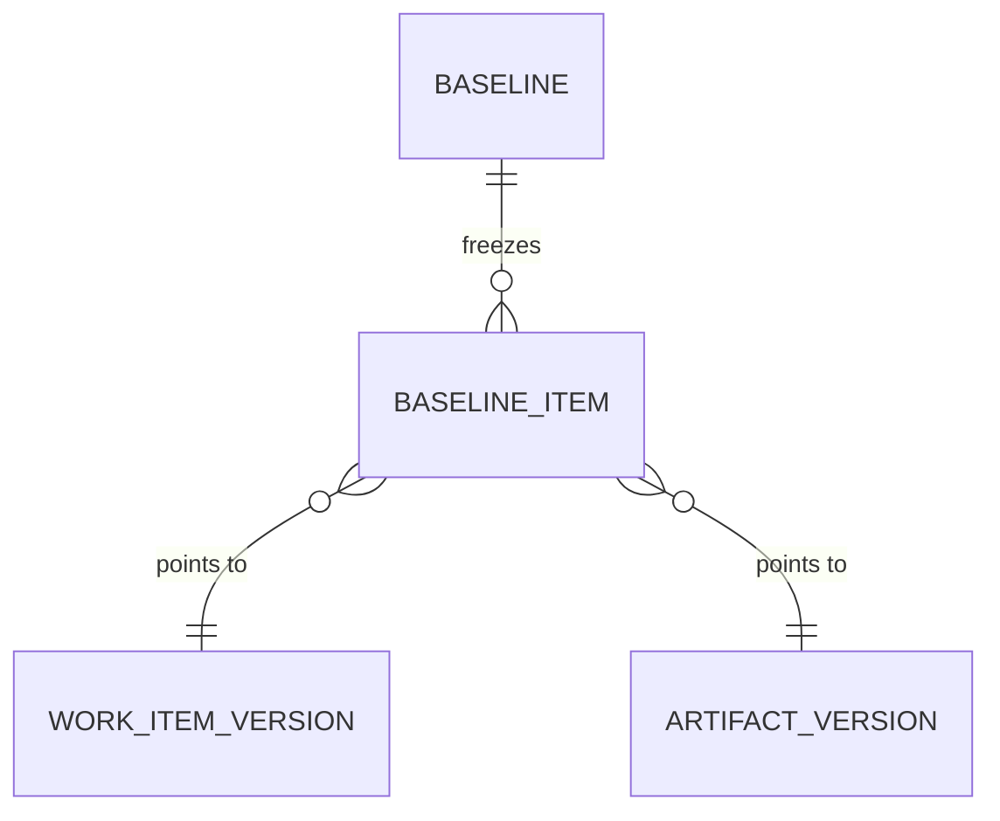

# 06. 베이스라인 & 감사 추적성 (Baseline / Audit)

요구 ②(통합관리)의 감사 대응 축. 규제산업(IEC 62304, ISO 26262, 21 CFR Part 11 등)에서
"특정 시점에 무엇이 승인됐는가"를 불변으로 증명한다.

## 1. 베이스라인이란
특정 시점의 **전체 산출물 상태(WorkItem + Artifact + Link 버전)를 통째로 동결**한 불변 스냅샷.
(IBM ELM / Polarion 베이스라인 패턴)

- Gate `Passed` 시 자동 생성 (해당 단계 산출물 확정본).
- 수동 생성도 가능(마일스톤, 릴리스 태깅).



| BASELINE 필드 | 설명 |
|---|---|
| id | |
| project_id | |
| label | `G1-approved`, `Release-1.2` |
| created_from | `gate:G1` / `manual` |
| gate_instance_id | Gate 통과로 생성된 경우 참조 |
| content_hash | 포함 아이템 해시들의 머클루트 — 위·변조 탐지 |
| created_at, created_by | |

`BASELINE_ITEM` 은 "현재값"이 아니라 **그 시점의 버전 레코드**를 가리켜 이후 변경에 영향받지 않는다.

## 2. Gate 서명과의 결합
[03](03-gate-workflow.md)의 Signature `payload_hash` = 그 시점 산출물 스냅샷 해시.
Gate 통과 시 동일 스냅샷이 Baseline 으로 동결되어, **"서명이 가리키는 대상 = 동결된 베이스라인"**
이 성립한다. 이후 산출물이 바뀌어도 서명·베이스라인은 불변.

## 3. 비교(diff)
두 베이스라인 간 무엇이 바뀌었는지 (감사·변경영향 분석).

```
GET /baselines/{A}/diff?to={B}
→ 추가/삭제/변경된 WorkItem, 변경된 Artifact block, 링크 변화
```

화면: 좌우 비교 뷰 + 변경 요약(추가 N, 수정 M, 삭제 K).

## 4. 감사 로그(Audit Trail)
append-only. 되돌리거나 지울 수 없다.

기록 대상:
- 모든 상태전이(WorkItem/Gate/Stage) — 누가·언제·이전→이후.
- 모든 승인·서명 — signer, method, payload_hash.
- 모든 자동생성 이벤트 — source_ref(어느 커밋/빌드/이슈에서 왔는지).
- 방법론/규칙 변경 — 프로세스 개선 이력(Polarion 글로벌설정 버전관리).

| AUDIT_LOG 필드 | 설명 |
|---|---|
| id, occurred_at | |
| actor | 사용자 or `system` |
| action | `state_change` / `approval` / `signature` / `auto_generate` / `config_change` |
| target_ref | 대상 엔티티 URI |
| before / after | 변경 전후(jsonb) |
| context | source_ref, gate_instance 등 |

## 5. 규제 매핑 예시

| 요구(규제) | 충족 메커니즘 |
|---|---|
| 21 CFR Part 11 전자서명 | Signature(재인증·의미문구·해시체인) |
| IEC 62304 추적성 | TraceLink + 추적성 매트릭스 + Gate 커버리지 조건 |
| 변경 통제 | ChangeRequest WorkItem → 커밋 추적성 → Baseline diff |
| 감사 대응 | 불변 Baseline + append-only Audit Log + Baseline export |

## 6. 보존·내보내기
- Baseline 은 삭제 불가(보존기간 정책에 따름), export 로만 반출.
- `POST /baselines/{id}:export?format=pdf|docx|xlsx` — 감사 제출용 문서 생성
  (ELM 자동 문서생성 패턴). export 물에도 content_hash 를 각인해 원본 대조 가능.
