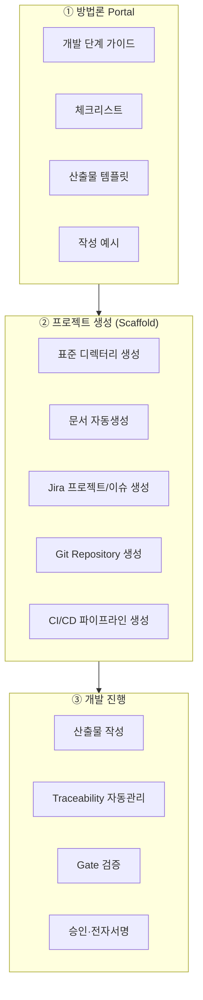
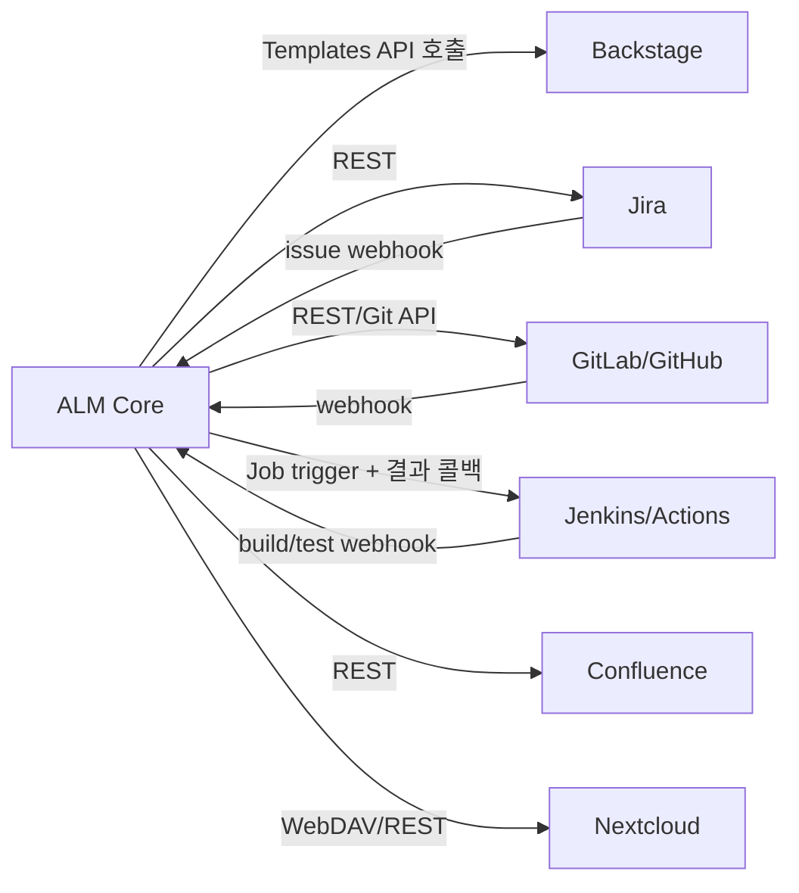

# 07. 플랫폼 레퍼런스 아키텍처 (Orchestration)

방법론 실행 플랫폼을 "자체 구현"이 아니라 **검증된 툴의 오케스트레이션**으로 구성한다.
ALM Core 는 지휘자이고, 실제 실행은 각 툴이 담당한다.

## 1. 기능 영역 → 툴 매핑

| 영역 | 역할 | 대표 구현 | ALM Core 소유 여부 |
|---|---|---|---|
| 방법론 관리 | 방법론·프로세스·역할·산출물 정의 | Confluence, (RMC/EPF) | **소유** (정의/상태) |
| 가이드 제공 | 단계별 절차·체크리스트 | Confluence, Backstage TechDocs | 위임 |
| 산출물 관리 | 템플릿·예시·버전관리 | Git, Confluence, Nextcloud | 위임(본문) + 소유(메타·링크) |
| 실행 자동화 | 프로젝트·표준구조 생성 | Backstage Templates, Cookiecutter | **소유**(오케스트레이션) |
| Gate 검증 | 필수 산출물·품질 자동확인 | Jenkins, GitHub Actions, GitLab CI | **소유**(판정) + 위임(실행) |
| 추적성 | 요구사항↔…↔릴리즈 연결 | Jira, RTM | **소유**(WorkItem/TraceLink) |

원칙: **판정·상태·추적성은 Core 가 소유, 저장·편집·실행은 툴에 위임.**

## 2. 권장 스택과 책임 경계

| 단계 | 담당 툴 | ALM Core 역할 |
|---|---|---|
| ① Portal | Confluence / Backstage TechDocs | 방법론·Gate 정의 원천 제공, 진행상태 오버레이 |
| ② Scaffold | Backstage Software Templates, Cookiecutter | 어떤 산출물/구조/툴을 만들지 지시, 결과를 WorkItem 으로 등록 |
| ③ 개발 | Jira·Git·CI | 이벤트 수신→추적성 갱신, Gate 상태 관리·승인 |

## 3. 컴포넌트별 연결 방식

- **Backstage**: Core 가 방법론에 정의된 템플릿 파라미터를 넘겨 프로젝트 생성을 위임.
  Backstage 는 Git repo·CI·문서 스캐폴드를 만들고, catalog 에 등록. ([08](08-project-scaffolding.md))
- **Jenkins/CI**: Gate 검증 잡을 트리거하고, 결과(통과/실패 + 리포트)를 콜백으로 수신. ([09](09-gate-validation.md))
- **Jira/Git**: 웹훅으로 개발 이벤트를 받아 추적성·상태를 갱신. ([02](02-artifact-automation.md), [05](05-integration-api.md))
- **Confluence/Nextcloud**: 문서 본문·대용량 산출물의 실제 저장소. Core 는 링크·메타·버전 포인터만 보관.

## 4. "얇은 지휘자" 유지 원칙
- Core DB 에는 **본문을 복제하지 않는다** — 문서 본문은 Confluence/Git 에, Core 는 참조·해시만.
- 툴별 어댑터는 교체 가능(pluggable): Jenkins→Actions, Confluence→Git-Markdown 등 대체 가능하도록
  어댑터 인터페이스로 추상화. ([05 §툴 어댑터](05-integration-api.md))
- 단일 진실 원천(SoT) 규칙:
  - 요구사항/작업 상태 SoT = Jira(또는 Core WorkItem — 프로젝트 정책으로 택1, 나머지는 mirror)
  - 문서 본문 SoT = Confluence 또는 Git
  - **추적성·Gate·베이스라인 SoT = 항상 ALM Core**

## 5. 배포 형태
- Core: 컨테이너(Web UI + API + Automation/Gate 워커 + DB).
- 툴은 기존 조직 인프라 재사용(신규 도입 최소화)이 오케스트레이션 우선 전략의 이점.
- GxP 환경: Core 는 감사로그·전자서명·베이스라인의 SoT 로서 밸리데이션 대상(부록 [06](06-baseline-audit.md)).
