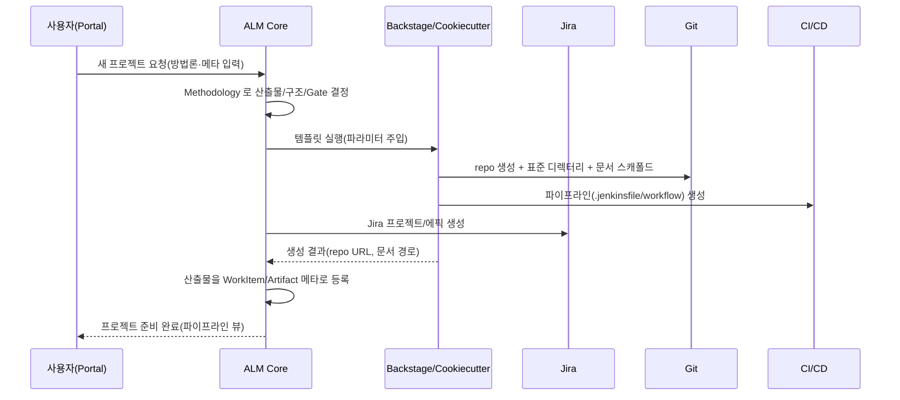

# 08. 프로젝트·산출물 자동생성 (Scaffolding)

방법론 실행의 시작점. 프로젝트 생성 한 번으로 표준 구조·문서·툴을 자동 구성한다.
(Backstage Software Templates / Cookiecutter 오케스트레이션)

## 1. 프로젝트 생성 플로우



## 2. 생성되는 표준 구조 (예시)

```
<project>/
├─ docs/
│  ├─ SRS.md            요구사항 명세
│  ├─ SDS.md            설계 명세
│  ├─ RTM.md            요구사항 추적 매트릭스
│  ├─ TestPlan.md
│  ├─ TestCase.md
│  ├─ ValidationReport.md
│  ├─ ReleaseNote.md
│  └─ BuildNote.md
├─ src/
├─ tests/
├─ .ci/
│  └─ gates/            단계별 Gate 검증 스크립트 ([09])
├─ alm.yaml             방법론·단계·Gate 바인딩 메타
└─ README.md
```

## 3. 자동생성 산출물과 메타데이터 주입

각 문서는 템플릿 + 자동 채움 메타데이터로 생성된다.

| 산출물 | 단계 | 자동 채움 항목 |
|---|---|---|
| SRS (요구사항 명세) | 요구사항 | 프로젝트명·버전·담당자, 요구사항 ID 규칙, Jira 에픽 링크 |
| SDS (설계 명세) | 설계 | 프로젝트 메타, SRS 역참조 |
| RTM (추적 매트릭스) | 설계~ | 요구사항↔설계↔테스트 링크(자동 갱신) |
| Test Plan / Test Case | 테스트 | 프로젝트 메타, 대상 요구사항 목록 |
| Validation Report | 테스트 | CI 테스트 결과 자동 반영 |
| Release Note | 릴리즈 | 버전·변경목록(커밋/PR 집계) |
| Build Note | 릴리즈 | 빌드 ID·아티팩트·환경 |

프론트매터 예시(문서 상단 메타):

```yaml
---
artifact: SRS
project: "결제 게이트웨이"
version: "1.0.0"
owner: "hong@corp.com"
methodology: "의료기기 SW (IEC 62304)"
stage: requirements
gate: G1
alm_ref: "https://alm.example.com/artifacts/SRS-payment"
id_rule: "REQ-\\d{3}"
---
```

문서 본문은 Git/Confluence 에 저장되고, Core 에는 `Artifact` 메타(참조·버전·상태)만 등록된다.

## 4. 방법론 → 템플릿 바인딩 (alm.yaml)

프로젝트가 어떤 방법론을 따르고 각 단계에서 무엇이 필요한지 선언.

```yaml
methodology: iec62304-v2
stages:
  requirements:
    artifacts: [SRS]
    gate: G1
  design:
    artifacts: [SDS, RTM]
    gate: G2
  implementation:
    artifacts: []
    gate: G3
  test:
    artifacts: [TestPlan, TestCase, ValidationReport]
    gate: G4
  release:
    artifacts: [ReleaseNote, BuildNote]
    gate: G5
scaffolder: backstage        # or cookiecutter
tools:
  issues: jira
  vcs: github
  ci: jenkins
  docs: git                  # or confluence
```

이 파일이 [09 Gate 검증](09-gate-validation.md)과 [02 자동생성](02-artifact-automation.md)의
기준 설정으로 재사용된다(단일 소스).

## 5. 멱등·재실행
- 스캐폴딩은 멱등: 이미 존재하는 repo/이슈는 건너뛰고 누락분만 보강.
- 방법론 개정 시 "drift 점검" — 기존 프로젝트 구조가 최신 템플릿과 다르면 마이그레이션 제안.
- 부분 커스터마이징 허용(Codebeamer Working Set 패턴): 프로젝트별 산출물 추가/제외를 alm.yaml 로 오버라이드.
