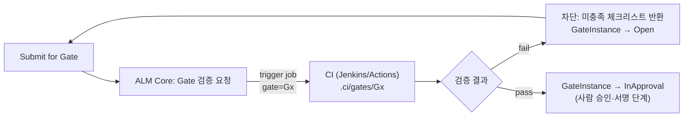
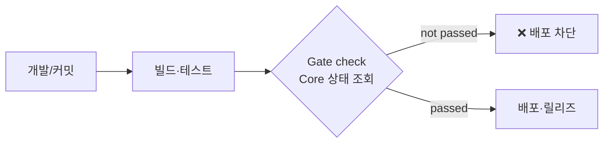

# 09. Gate 자동검증 & 차단 (CI-based Gate Validation)

[03 Gate 워크플로우](03-gate-workflow.md)의 `ConditionCheck` 를 **CI(Jenkins/Actions/GitLab CI)**로
실행하는 구체 설계. 통과하지 못하면 다음 단계(CI/CD·배포·승인)로 **진행 차단**한다.

## 03 문서와의 관계
- 03 = Gate 의 상태 머신·승인·전자서명(사람 축).
- 09 = 그 중 `pass_conditions` 자동 검증을 CI 잡으로 실행하는 방법(기계 축).
- Gate 통과 = **자동검증 통과(09) + 승인·서명(03)** 둘 다 충족.

## 1. 단계별 자동 검증 항목

| 단계 | Gate | 자동 검증 |
|---|---|---|
| 요구사항 | G1 | SRS 존재, 요구사항 ID 규칙(`REQ-\d{3}`) 준수, 빈 필수필드 0 |
| 설계 | G2 | SDS 존재, RTM 작성, 모든 요구사항이 설계로 파생(derives) |
| 구현 | G3 | 코드 리뷰 완료(PR approved), 정적분석 통과, 빌드 성공 |
| 테스트 | G4 | 테스트케이스·결과서 존재, 테스트 통과율 기준 충족, 미해결 결함 기준 이하 |
| 릴리즈 | G5 | 릴리즈 노트·빌드 노트 존재, 승인 기록 확인, 베이스라인 생성 가능 |

## 2. 검증 실행 파이프라인



Core 는 검증 로직을 직접 구현하기보다 **CI 잡을 호출**하고 결과를 수집한다(오케스트레이션).
검증 스크립트는 스캐폴딩 시 생성된 `.ci/gates/` 에 산다([08](08-project-scaffolding.md)).

## 3. Gate 검증 규칙 정의 (선언형)

`alm.yaml` 의 단계 정의를 확장하거나 Gate 별 규칙 파일로 관리.

```yaml
gates:
  G1:
    checks:
      - artifact_exists: SRS
      - id_convention: { artifact: SRS, pattern: 'REQ-\d{3}' }
      - no_empty_required_fields: SRS
  G3:
    checks:
      - pr_reviews_approved: { min: 1 }
      - static_analysis: { tool: sonarqube, quality_gate: pass }
      - build: { status: success }
  G4:
    checks:
      - artifact_exists: [TestPlan, TestCase, ValidationReport]
      - test_pass_rate: { min: 100 }
      - trace_coverage: { from: requirement, link: verifies, min: 95 }
      - open_defects: { severity_max: minor }
  G5:
    checks:
      - artifact_exists: [ReleaseNote, BuildNote]
      - approvals_recorded: true
```

각 `check` 는 CI 잡의 스텝으로 매핑되며, 결과는 `{check, status, detail}` 로 Core 에 반환된다.

## 4. 차단(enforcement) 메커니즘

Gate 미통과 시 "다음 단계로 못 가게" 만드는 세 겹의 강제:

1. **상태 잠금(Core)**: 다음 Stage 는 `Locked` 유지 — UI·API 편집 차단([04 §잠금규칙](04-screen-flow.md)).
2. **파이프라인 차단(CI)**: 배포 잡이 Core 의 Gate 상태를 조회해 `passed` 아니면 실패 처리
   (예: 배포 스테이지 전 `alm gate check --gate G4` 게이팅 스텝).
3. **머지/브랜치 보호(VCS)**: `release/*` 브랜치는 Gate 통과 상태를 required check 로 설정.



## 5. 결과의 산출물화·감사
- 검증 결과 리포트(정적분석·테스트·커버리지)는 해당 단계 산출물(ValidationReport 등)에 자동 반영
  ([02](02-artifact-automation.md)).
- 통과/실패 이력, 우회(override) 사용 시 사유·승인자는 감사로그에 append-only 기록
  ([06](06-baseline-audit.md)).
- Gate 통과 시점의 검증 리포트는 베이스라인에 함께 동결되어 "무엇을 근거로 통과시켰는가"를 증명.

## 6. 우회(예외) 처리
- 일부 규제 예외 상황을 위해 `override` 허용하되:
  - 별도 권한 역할만 가능,
  - 사유·근거 필수 입력,
  - 감사로그·베이스라인에 명시적 기록,
  - 우회된 check 는 리포트에 `waived` 로 표시(숨기지 않음).
