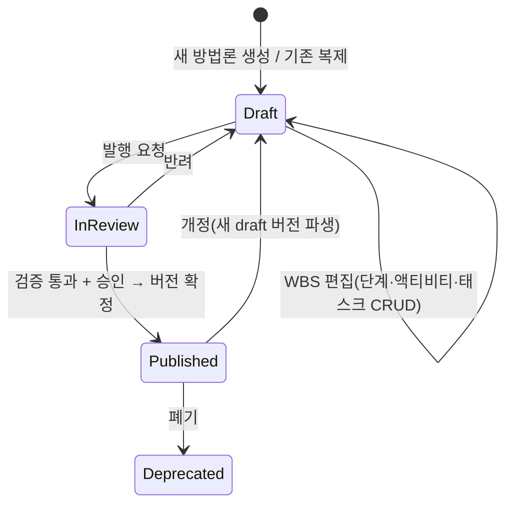

# 11. 방법론 저작 (Authoring) — 3레벨 WBS 사용자 등록

방법론을 코드가 아니라 **화면에서 사용자가 직접 등록·편집**한다.
단계(레벨1) · 액티비티(레벨2) · 태스크(레벨3)를 트리로 만들고, 산출물·Gate·역할을 붙인 뒤 발행한다.

> 구분: **저작(Authoring)** = 조직 표준 방법론(마스터)을 만드는 일. **테일러링([10](10-tailoring.md))**
> = 프로젝트가 그 마스터를 자기 상황에 맞게 조정하는 일. 권한·주체가 다르다.

## 1. 주체와 권한

| 역할 | 권한 |
|---|---|
| **Methodology Owner / Process Engineer** | 방법론 생성·WBS 편집·발행·폐기 |
| Reviewer | 초안 검토·승인 |
| (프로젝트 팀) | 발행된 방법론 **선택·테일러링만** (마스터 편집 불가) |

## 2. 저작 라이프사이클



- **Draft** 만 편집 가능. **Published** 는 불변(프로젝트가 pin 하므로).
- 개정은 published 를 복제해 새 draft(예: v2.0 → v2.1)로 시작 → 진행 중 프로젝트 무영향.

## 3. WBS 편집 연산

트리에서 각 레벨을 직접 추가/수정/이동/삭제한다.

| 연산 | 단계 | 액티비티 | 태스크 |
|---|---|---|---|
| 추가(add) | + 단계 | + 액티비티(부모 단계) | + 태스크(부모 액티비티) |
| 이름변경(rename) | ✓ | ✓ | ✓ |
| 순서변경(reorder) | 드래그 | 드래그 | 드래그 |
| 이동(move) | — | 다른 단계로 | 다른 액티비티로 |
| 삭제(delete) | ✓(하위 포함 경고) | ✓ | ✓ |

WBS 코드(`2`, `2.1`, `2.1.1`)는 순서/이동에 따라 **자동 재부여**한다(사용자는 이름·속성만 신경 씀).

## 4. 노드별 편집 속성

| 레벨 | 편집 속성 |
|---|---|
| **단계(Stage)** | 이름 · key · 진입조건 · **Gate 연결**(Gate key, 승인정책: 역할·quorum·서명) · 통과조건 |
| **액티비티(Activity)** | 이름 · 담당 역할 · 설명 |
| **태스크(Task)** | 이름 · 수행 역할 · **산출물 생성 여부 + ArtifactTemplate** · `gate_relevant` · `mandatory`(정책잠금) · 가이드 링크 · **체크리스트 항목** · 자동완료 훅 |

- 산출물 템플릿(ArtifactTemplate)도 여기서 등록: 문서 key, 블록 스키마, 자동채움 소스([02](02-artifact-automation.md)).
- `mandatory:true` 로 잠근 산출물/태스크는 테일러링에서 생략 불가([10](10-tailoring.md)).

## 5. 발행 전 검증 (Publish Validation)

발행 시 자동 검사. 하나라도 실패하면 발행 차단.

- 모든 **단계에 Gate** 가 연결돼 있는가.
- 모든 **Gate 에 승인정책**(역할·quorum)이 있는가.
- 빈 단계/액티비티(하위 없음)가 없는가.
- 태스크 WBS 코드 유일성, 이름 공백 없음.
- `required_for_gate` 산출물이 실제 태스크에 존재하는가.
- (경고) 검증(verifies) 링크 규칙이 정의된 요구사항 산출물이 있는가.

## 6. 재사용·가져오기
- **복제(clone)**: 기존 방법론에서 시작해 수정.
- **가져오기(import)**: RMC/EPF, Excel/CSV WBS, 또는 JSON 스키마로 일괄 등록.
- **부분 라이브러리**: 자주 쓰는 액티비티/태스크·산출물 템플릿을 라이브러리화해 드래그로 재사용.

## 7. 저장 형식 (내보내기/버전관리)
방법론 정의는 사람이 읽고 diff 가능한 선언형으로도 내보낼 수 있다(방법론-as-Code, 감사·이관용).

```yaml
methodology: iec62304
version: 2.1
status: draft
stages:
  - key: requirements
    name: 요구사항
    gate: { key: G1, roles: [QA_Lead, PM], quorum: 2, signature: true }
    activities:
      - key: "2.1"
        name: 요구사항 수집
        role: Analyst
        tasks:
          - { key: "2.1.1", name: 이해관계자 인터뷰, role: Analyst }
          - { key: "2.1.2", name: 현행 시스템 분석, role: Analyst }
      - key: "2.3"
        name: 요구사항 명세
        role: Analyst
        tasks:
          - key: "2.3.1"
            name: SRS 작성
            deliverable: { template: SRS, required_for_gate: true, mandatory: true }
            checklist: [범위 정의, 요구사항 ID 규칙 준수, 이해관계자 승인]
```

이 파일은 [08 스캐폴딩](08-project-scaffolding.md)의 `alm.yaml` 기준 설정과 동일 계보이며,
UI 편집 ↔ YAML 은 양방향(round-trip)으로 동기화된다.

## 8. 화면 (목업 대응)
**방법론 편집기**: 좌측 WBS 트리(레벨별 +추가·편집·삭제) + 우측 선택 노드 속성 폼 +
상단 draft/버전·검증 상태·발행 버튼.
